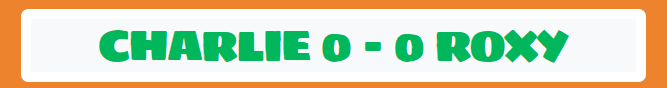

# Greedy Chops - Milestone project 2
#### Welcome to Greedy Chops! The aim of the game is to get the lamb chops past Roxy so that Charlie can catch them!
#### The game is simple yet addictive and has been designed in a way that makes user navigation easy and prompts the player to keep playing!

[Live link to website](https://https://bky93.github.io/Greedy-chops-project-2/)

# User Stories

## Target Audience

Greedy chops is aimed at a wide demographic in that most ages can play! It's simple layout, bright colours and fun graphics are appealing to all ages.

## User Goals

* As a user, I want to be able to very quickly get a sense of how the game can be navigated

* As a user, I want to be able to very quickly get a sense of the functions of the buttons on the page

* As a user, I want information on how to play the game to be easily available

* As a user, I want to be able to reset the game at any time

* As a user, I want to be able to see my score

* As a user, I want to be able to see an output after every game turn

* As a user, I want to be able to easily access a way of choosing to replay the game, without having to find the reset button

# Design 

## UX and Design
The website has been designed to be simple so that the user can easily navigate the page and eye catching so that the user is drawn to the game when they open the page. The design and graphics aim to appeal to a wide demographic and the ease of playing the game means it can be enjoyed by most ages. The game has been designed so that the next step for the user to take is obvious. This website has also been made responsive for various screen sizes to ensure a consisent and positive user experience.

## Wireframes

### Mobile

### Desktop

## Typography

The font chosen for this game is "Sigmar" which is taken from Google fonts. I chose this fotn because I believe it looks playful and is therefore appropriate for a game, it is interesting and should grab the user's attention and it is tasteful.

## Color scheme

The colour scheme for this website was made by chosing the colour "#ED832D" and then using https://mycolor.space to generate a colour palette:

White was also added to this colour palette to brighten the page up as the grey colours suggested sometimes seemed too dull.

# Features

## Favicon

A meat chop/cut of meat favicon was used to fit in with the theme of the game, this was taken from https://favicon.io/emoji-favicons/cut-of-meat/.

## Game title

The game title was chosen as it seemed an appropriate play on words for the concept of the game and is catchy, prompting the user to remember it and draw them back to the site. The typography, colour scheme and size were combined to make the game title striking when the user first looks at the page. This partnered with the font awesome icon used: https://fontawesome.com/icons/bowl-food?f=classic&s=solid shows the user the name and theme of the game.

## How to play button

The "how to play" button has been put right underneath the game title so that the user can easily access information on how to play the game without scrolling the page. The button colour changes when the user hovers over the button, clarifying to the user the action they need to take and to entice the user to click. The design of the button is fitting with the rest of the game theme and helps the page flow easily. When the user clicks on the how to play button, a modal opens with instructions on how to play the game.

How to play button:

How to play button when the user hovers over it:

## Reset button
The reset button has been put next to the how to play button, as logically it seems that they would be part of the same groups and right underneath the game title so that the user can easily access it when they want to reset the game. The button colour changes when the user hovers over the button, clarifying to the user the action they need to take and to entice the user to click. The design of the button is fitting with the rest of the game theme and helps the page flow easily. When the user clicks on the reset button, the page reloads causing the game and scores to reset.

Reset button:

Reset button when the user hovers over it:

## How to play modal

The how to play modal has been designed so that it becomes visible when the user clicks on the "how to play" button. The modal has been designed to fit with the ongoing theme of the game and contains an image that fits with the other images in the game to keep the user interested. The instructions have been written so they are clear and concise and straight to the point to ensure the user is confident in how to play them game after reading them. The modal can be closed by either clicking on the x at the top of the modal or clicking outside of the modal.

## Scoreboard

The scoreboard has been designed so it visibily fits with the rest of the game but also stands out enough to be prominent to the user. The score is updated with the current score of the game after each turn and is simple to ensure the score is clearly indicated to the user.

## Game images

The game images have been designed to make the game enjoyable and easily understandable for the user. The graphics used were created on https://www.canva.com and designed to be suitable for all ages. The images have been designed with bright colours to grab the user's attention and keep them engaged in the game.

## Game text

The game text sits underneath the main game image, intially as a prompt for the user to click one of the direction buttons to start the game. Once the player has picked a direction and either the user/ Charlie wins a point or Roxy wins a point, the text is updated to reflect this. This has been done with the user in mind to ensure that it is always clear what is happening in the game and will prompt the user to look at the scoreboard.

Game text before the game starts:

Game text if the user/Charlie win a point:

Game text if the Roxy wins a point:

## Direction buttons

The game direction buttons allow the user to chose which direction to throw the chop: left, middle, or right. The buttons change colour when the user hovers over them, clarifying to the user the action they need to take and to entice the user to click. The design of the button is fitting with the rest of the game theme and helps the page flow easily.

## Replay button

The replay button has been created for the user to be able to easily access a way of choosing to replay the game, without having to find the reset button. The bright colour has been chosen to separate it from the rest of the game features.

# Future Implementations

In the future I would like to add some effects to the game such as a confetti effect when the user wins the game, or a meat chop confetti so it looks like it's raining meat chops.

# Accessibility

I have used alt attributes for all images on the website and aria labels. I have also used back up fonts.

# Technologies used

**GitPod**

Gitpod is the IDE used for editing my site and pushing changes.

**GitHub**

I used github for storage of the site

**Git**

Git was used for version control through the Gitpod terminal.

**Python**

Python was used when opening a port 8000 preview when coding in Gitpod.

**HTML5** 

HTML5 forms the foundation of the website’s structure.

**CSS** 

CSS was used to style the elements of the website.

**Javascript**

Javscript was used to make the game functional.

**Font Awesome** 

I used Font Awesome Icons on my website.

**Google Fonts**

The font used on the website is 'Sigmar' from Google fonts.

**Favicon**

The icon next to the page title is from Favicon.

**Canva**
Canva was used to design all game images

**Balsamiq**
Balsamiq was used to create the mobile and desktop wireframes for the site.

## Languages Used

HTML5, CSS, JavaScript

## Libraries and programmes used

GitHub backing up all aspects of the project. Bootstrap was used for across the site for responsiveness, style and layout.

